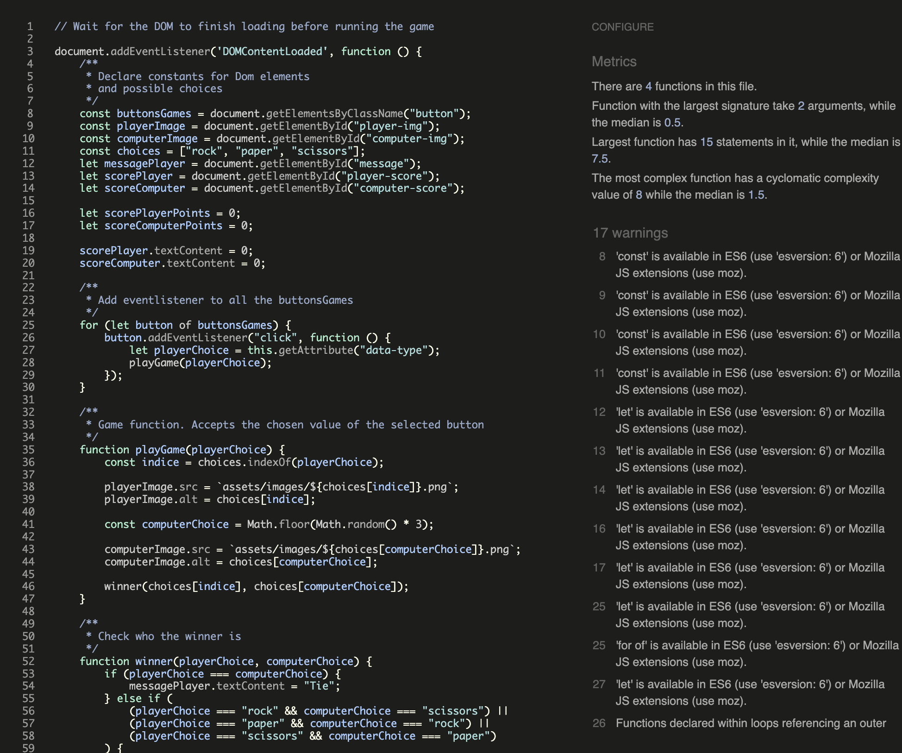
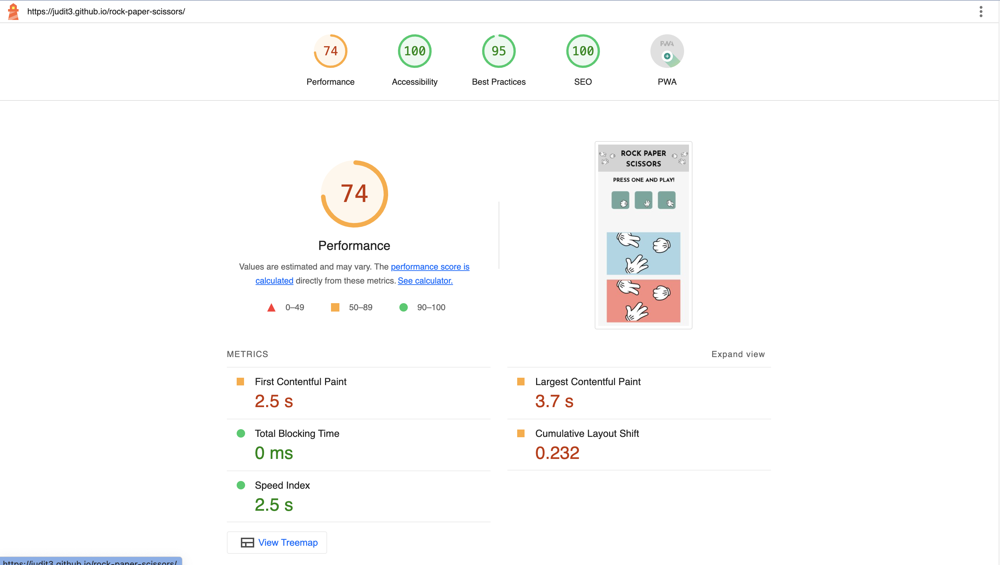
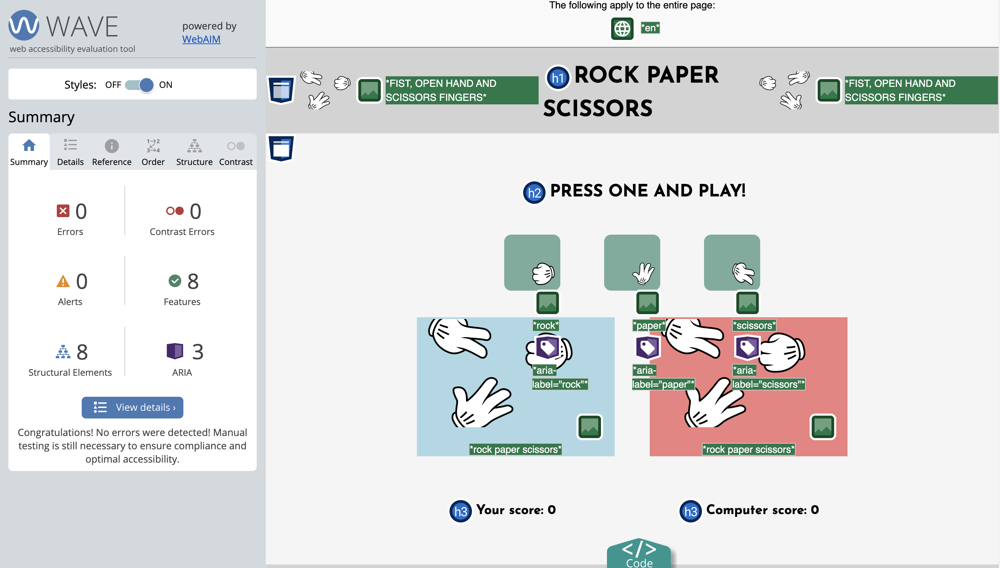

# Rock, Paper, Scissors
Rock, Paper Scissors is a game where the user plays against the machine which generates random results.
The site will be targeted toward people who enjoy playing rock, paper, scissors game.

---

## CONTENTS

- [Rock, Paper, Scissors](#rock-paper-scissors)
  - [CONTENTS](#contents)
  - [Design](#design)
    - [Typography](#typography)
    - [Imagery](#imagery)
    - [Wireframes](#wireframes)
  - [Features](#features)
    - [Existing Features](#existing-features)
    - [Features Left to Implement](#features-left-to-implement)
    - [Accessibility](#accessibility)
  - [Testing](#testing)
    - [CSS validation](#css-validation)
    - [HTML validation](#html-validation)
    - [JS validation](#js-validation)
    - [Performance](#performance)
    - [Accessibility](#accessibility-1)
    - [Manual testing](#manual-testing)
    - [Unfixed Bugs](#unfixed-bugs)
  - [Technologies used](#technologies-used)
    - [Languages used](#languages-used)
  - [Deployment](#deployment)
    - [How to deploy](#how-to-deploy)
    - [Local development](#local-development)
      - [How to clone](#how-to-clone)
      - [How to fork](#how-to-fork)
  - [Credits](#credits)
    - [Code used](#code-used)
    - [Content](#content)
    - [Media](#media)
    - [Acknowledgments](#acknowledgments)

---

## Design

### Typography

Google Fonts was used for the Josefin Sans, it is used for the entire site. It is a sans-serif font. It was chosen as it looked clean and modern.

### Imagery

The images were taken from clipartmax.com. I have credited this in the [Credits](#credits) section.

### Wireframes

Wireframes were created for mobile and desktop. The wireframes were generates using balsamic, and the images were modified with canvas.

## Features

### Existing Features

- __The Rock, Paper, Scissors Logo and Heading__

  - Featured at the top of the page, the Rock, Paper, Scissors logo and heading shows the name of the game and an image that helps the user to identify the game. It is used a font that is clear and easily readable by the user.

- __The Game Options__

  - This section will allow the user to play the game. The users will be able to easily see buttons with icons that allow them to play.
  - The users will be able to select between rock, paper or scissors to be played, they will be playing by clicking on the different buttons with icons, the chosen button will change its colour to match the colour of the players choice displayed under the buttons.
  

- __The Choice Area__

  - The choice area is where the users will be able to see their choice and the computer generated choice.
  - Once users have made their selection by clicking on one of the buttons a message will let the users know if they won or lose and the images of their and the computer choices will be shown.

- __The Score Area__

  - This section will allow the users to see exactly how many times they and the computer won.

- __The Footer__

  - The footer section shows the rules of the game.

### Features Left to Implement

  - Improve the rock, paper, scissors images.
  - It could have some animation when the player wins or loses.
  
### Accessibility

Alt-labels are used for images. Aria-labels for screen readers are implemented at certain places, also semantic elements are used so the page is easy to navigate.

## Testing

### CSS validation

The CSS code was validated using W3C tool.

### HTML validation

The HTML code was validated using the W3C tool.

### JS validation

The JavaScript code was validated using the JSHint tool.

- No errors were found when passing through the official [Jshint validator](https://jshint.com/)
- The following metrics were returned:
  - There are 4 functions in this file.
  - Function with the largest signature take 2 arguments, while the median is 0.5.
  - Largest function has 15 statements in it, while the median is 7.5.
  - The most complex function has a cyclomatic complexity value of 8 while the median is 1.5.

### Performance

Website performance was checked with Lighthouse tool.

### Accessibility

To check accessibility the Wave Web Accessibility Evaluation tool was used. No errors were detected.

### Manual testing

Manual testing was done to check common elements and how they perform on different devices:

1.	Clicking on any of the buttons loads the right image on the player choice and the computer choice is automatically generated, showing the win/lose/tie message and updating the scores.
2.  Confirmation that the right image is displayed, the result and the update of scores are correct.
3.	The responsiveness of the web page.

Following devices and browsers were used:

Laptop:

- Macbook Pro

Mobile Devices:

- iPhone SE
- Samsung 
  
Browsers:

- Google Chrome
- Safari
  
### Unfixed Bugs

No bugs were detected.

## Technologies used

__GitHub__ – storage and deployment 
__Codeanywhere__ – IDE used to write, edit, commit and push the code to GitHub 
__Google Fonts__ – import font 
__Favicon Generator Website__ – convert logo 
__Balsamiq__ – wireframes design 
__Am I Responsive?__ – check responsiveness of the website 
__Python__ - python 3 via terminal to preview my site using a local http server 
__HTML5__ - build the core of the site 
__CSS__ - style the website and define fonts and layout 
__Google Chrome__ - build and test the website 
__Canva__ - change format of images 

### Languages used

- HTML
- CSS
- Javascript

## Deployment

The site was deployed to GitHub pages.
The project was developed in CodeAnywhere application, where it was committed and pushed to GitHub where it was deployed.
The live link can be found here - <https://judit3.github.io/rock-paper-scissors/>

### How to deploy

1. Log into your account on github
2. Go to the repository of this project, Judit3/rock-paper-scissors
3. Go to the Settings tab of this GitHub repository
4. On the left-hand sidebar, in the Code and automation section, select Pages
5. Make sure:

- Source is set to 'Deploy from Branch'
- Main branch is selected
- Folder is set to / (root)

6. Under Branch, click Save
7. Go back to the Code tab. Wait a few minutes for the build to finish and refresh your repository
8. On the right-hand side, in the Deployments section, click on 'github-pages'
9. Click on the "open in another tab" symbol to see the live site. The URL will be judit3.github.io/rock-paper-scissors/

### Local development

#### How to clone

1. Log into your account on github
2. Go to the repository of this project, Judit3/rock-paper-scissors
3. Click on the code button, and copy your preferred clone link
4. Open the terminal in your code editor and change the current working directory to the location you want to use for the cloned directory
5. Type 'git clone' into the terminal, paste the link you copied in step 3 and press enter

#### How to fork

To fork the repository:

1. Log in (or sign up) to Github
2. Go to the repository for this project, Judit3/rock-paper-scissors
3. Click the Fork button in the top right corner

## Credits

### Code used

1.	Some code was taken and modified from Love Maths Project Challenge and from the example of rock, paper scissors project provided by CodeInstitute.
2.	The rest of the code was created by the developer.

### Content

Content was partially written and created by the developer with inspiration from other CodeInstitute projects.

### Media

Images were downloaded from website clipartmax.com (https://www.clipartmax.com) 

### Acknowledgments

My friends for continuous support and helpful feedback.
